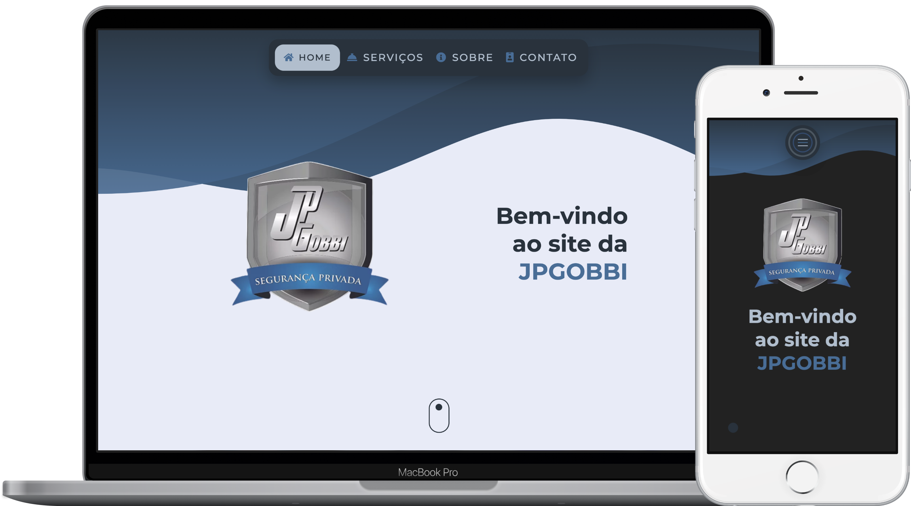

<h1 align="center"> ⌨️ Shaif Arfan 💻 📱 Front End Developer Portfolio 🖱 </h1>

<a href="#keyboard-sobre">Sobre</a>&nbsp;&nbsp;&nbsp;|&nbsp;&nbsp;&nbsp;
<a href="#rocket-tecnologias">Tecnologias</a>&nbsp;&nbsp;&nbsp;|&nbsp;&nbsp;&nbsp;
<a href="#video_game-curiosidades">Curiosidades</a>&nbsp;&nbsp;&nbsp;|&nbsp;&nbsp;&nbsp;
<a href="#airplane-execute">Execute</a>&nbsp;&nbsp;&nbsp;|&nbsp;&nbsp;&nbsp;
<a href="#vertical_traffic_light-importante">Importante</a>&nbsp;&nbsp;&nbsp;|&nbsp;&nbsp;&nbsp;
<a href="#bulb-aprendizado">Aprendizado</a>&nbsp;&nbsp;&nbsp;|&nbsp;&nbsp;&nbsp;
<a href="#bomb-features">Features</a>&nbsp;&nbsp;&nbsp;|&nbsp;&nbsp;&nbsp;
<a href="#fuelpump-autor">Autor</a>&nbsp;&nbsp;&nbsp;|&nbsp;&nbsp;&nbsp;
<a href="#memo-licença">Licença</a>

 

  

## :keyboard: Sobre:

Projetinho para praticar um pouco mais de **desenvolvimento**, **layout** e **responsividade**, após algumas pesquisas no **Youtube**.

## :rocket: Tecnologias:

O portfolio do **Shaif Arfan** foi desenvolvido utilizando:

- HTML 5
- CSS 3
- JAVASCRIPT

## :video_game: Curiosidades:

- Online no **Github Pages**, confira pelo link: [Shaif Arfan](https://alissonpratesperes.github.io/shaifarfanportfolio);

- Responsivo, acesse pelo **Computador**, **Tablet** ou **Smartphone**.

## :airplane: Execute:

- Baixe uma cópia em "**.zip**" do repositório;

- Extraia utilizando um **descompactador de arquivos**;

- Abra o arquivo **index.html**: **arrastando-o para dentro do seu navegador**, ou utilizando o **botão direito do mouse  e clicando em abrir com...** .

## :vertical_traffic_light: Importante:

- Foi desenvolvido **seguindo a playlist e a interface proposta sem desvios**, portanto poderão ser notados alguns pontos de correção;

- Também poderão ser identificados alguns **pontos de melhoria com possibilidade de novas implementações de funcionalidades e/ou design**;

- Essa aplicação poderá apresentar **inconsistências tanto de layout quanto funcionalidades dependendo do dispositivo de acesso**, uma vez que **não está otimizada e/ou preparada para _crossbrowsing_**;

## :bulb: Aprendizado:

- **CSS Global** para aplicação em **várias áreas** do site;

- **Barra de Navegação** responsiva para os modos **mobile** e **desktop**;

- **CSS FlexBox** para os **alinhamentos automáticos**;

- **Media Queries** para a **responsividade completa**;

- **Pseudo-Elementos** para o **design**; 

- Tratativas de **classes** com **Javascript**;

- Eventos de **click** e **scroll** com **Javascript**;

- Menu **off-canvas** com **Javascript**.

## :bomb: Features:

Para testar os novos conhecimentos adquiridos, implementei algumas **features novas** para fazer **a minha versão dessa aplicação**, e também **resolvi um bug** que encontrei durante o desenvolvimento.

- Implementação da **Progress Bar** na parte inferior da página para **exibir o progresso atual da rolagem na tela**, com **Vanilla JS**;

- Implementação do **Scroll Spy** para, de **acordo com a section atual na tela, ativar o link correspondente do menu**, com **Vanilla JS**;

- Corrigido o **background scroll** quando o **mobile menu era ativado (onde mesmo aberto, a rolagem da página ainda continuava ativa)**. Através da **tratativa de classe no HTML**, com **Vanilla JS**.

## :fuelpump: Autor:

- Dê um **fork** no **repositório oficial** desse projeto, através desse link: [WEB CIFAR](https://github.com/WebCifar/one-page-website-html-css-project-for-practice);

- Assista ao [vídeo do projeto](https://www.youtube.com/watch?v=ZFQkb26UD1Y) no canal do **Youtube** da **WEB CIFAR**.

## :memo: Licença:

Esse projeto está sob a **Licença MIT**. Veja o arquivo [LICENSE](LICENSE.md) para mais detalhes.

---

<h5 align="center">  ✍🏻&nbsp; &nbsp;na &nbsp;👋🏻&nbsp;  por <a href="https://github.com/alissonpratesperes"> Alisson Prates Peres </a> &nbsp;👨🏻‍💻 </h5>
