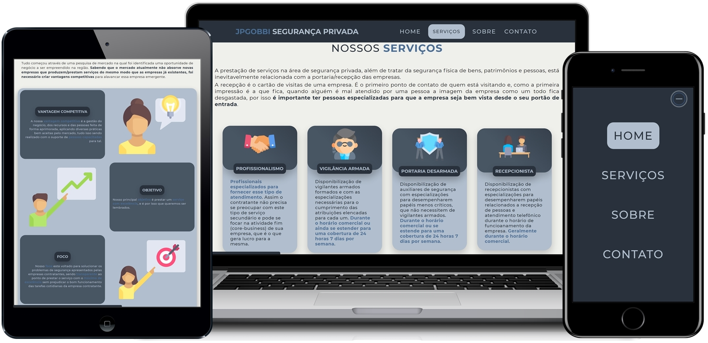

<h1 align="center"> 🚔 👮 JPGOBBI Segurança Privada 🛡️ 🔫   🖥️ 💻 Site Institucional Responsivo 📱 🖱️ </h1>

<a href="#dart-sobre">Sobre</a>&nbsp;&nbsp;&nbsp;|&nbsp;&nbsp;&nbsp;
<a href="#battery-tecnologias">Tecnologias</a>&nbsp;&nbsp;&nbsp;|&nbsp;&nbsp;&nbsp;
<a href="#video_game-curiosidades">Curiosidades</a>&nbsp;&nbsp;&nbsp;|&nbsp;&nbsp;&nbsp;
<a href="#lock-importante">Importante</a>&nbsp;&nbsp;&nbsp;|&nbsp;&nbsp;&nbsp;
<a href="#bomb-features">Features</a>&nbsp;&nbsp;&nbsp;|&nbsp;&nbsp;&nbsp;
<a href="#rocket-valor">Valor</a>&nbsp;&nbsp;&nbsp;|&nbsp;&nbsp;&nbsp;
<a href="#fuelpump-autor">Autor</a>

 

  

## :dart: Sobre:

**Primeiro projeto desenvolvido como *eugência* para o primeiro cliente**. Através da montagem de um *site institucional* completamente **responsivo**, **moderno** e **acessível por qualquer plataforma**/**dispositivo**.

## :battery: Tecnologias:

O site da **JPGOBBI Segurança Privada** foi desenvolvido **utilizando códigos puros** (*sem frameworks/plugins* - **evitando possíveis incompatibilidades** e **falta de controle de código**), com as seguintes tecnologias:

- HTML 5
- CSS 3
- JAVASCRIPT

## :video_game: Curiosidades:

- Responsivo, acesse pelo **Computador**, **Tablet** ou **Smartphone**;

- **APIs de terceiros** nos *cards de contato*, utilizando **recursos nativos** do **dispositivo de acesso** para **entrar em contato com a empresa**;

- Essa aplicação, dentro do possível de conhecimento até o presente momento foi **devidamente preparada** para a navegação **crossbrowsing**, ou seja, os **códigos-fonte** foram **especificamente preparados** para as plataformas **Android** e **iOS** com suas *particularidades implementadas também em código puro*.

## :lock: Importante:

- **Não é permitida** a **distribuição** ou **cópia** dos códigos contidos nesse repositório, que estão públicos **apenas para o compartilhamento do portfólio**.

## :bomb: Features:

Foram implementadas algumas **features novas** que não estavam no escopo inicial do projeto, mas que serviram como melhoria tanto de *funcionalidade* como *design*.

- Implementação da **Progress Bar** na parte inferior da página para **exibir o progresso atual da rolagem na tela**, com **Vanilla JS** para os *dois modos de acesso*;

- Implementação do **Scroll Spy** para, de **acordo com a section atual na tela, ativar o link correspondente do menu**, com **Vanilla JS** para os *dois modos de acesso*;

- Implementação do **Smooth Scroll** com **código puro** em **Vanilla JS** por causa das *particularidades de alguns navegadores mobile* como **Safari** e **Chrome**, que não processavam algumas *Propriedades em CSS* impossibilitando o *Smooth Scrolling* de funcionar de forma adequada quando desenvolvido apenas com *CSS*;

- Implementação de **Auto Hide** na **Barra de Navegação** através do *evento de scroll* monitorado com **Vanilla JS**, para *melhor aproveitamento de tela* do *dispositivo de acesso* - *recolhendo* e *exibindo* **independente da seção ativa na tela**;

- Corrigido o **background scroll** quando o **mobile menu era ativado (onde mesmo aberto, a rolagem da página ainda continuava ativa)**. Através da **tratativa de classe no HTML**, com **Vanilla JS** - por causa do *crossbrowsing* em *Android* e *iOS* (essa falha não acontecia no **DEVTOOLS - Google Chrome**.

## :rocket: Valor:

Iniciando nessa área de **desenvolvimento** como **eugência**, além de entregar uma **aplicação moderna**, **intuitiva** com as **melhores tecnologias** e totalmente de acordo com as **necessidades do cliente**, o **foco** sempre está em **entregar o maior valor possível**, seja em **resultados** ou na **redução de custos**. Portanto, durante esse projeto conseguimos obter:

- Uma aplicação **moderna**, **intuitiva**, **enxuta** e com as **melhores tecnologias do mercado** seguindo as principais **boas práticas** de **desenvolvimento**;

- Migração de uma *hospedagem* **engessada** para um serviço de *hospedagem* **flexível** e **moderno**, com **suporte técnico** ágil para a *resolução* de **dúvidas** e **problemas**;

- E de quebra, conseguimos reduzir o valor anual de **custos operacionais** para manter a aplicação no ar em **52%**.

## :fuelpump: Autor:

- Gostou do meu trabalho? Siga o meu perfil aqui no **Github**, clicando no **meu nome** ali em baixo e acompanhe mais alguns dos meus projetos! 👇🏻

---

<h5 align="center">  ✍🏻&nbsp; &nbsp;na &nbsp;👋🏻&nbsp;  por <a href="https://github.com/alissonpratesperes"> Alisson Prates Peres </a> &nbsp;👨🏻‍💻 </h5>
